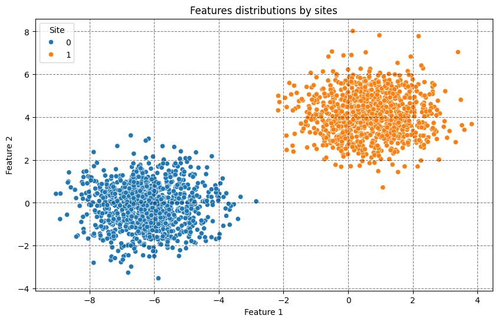
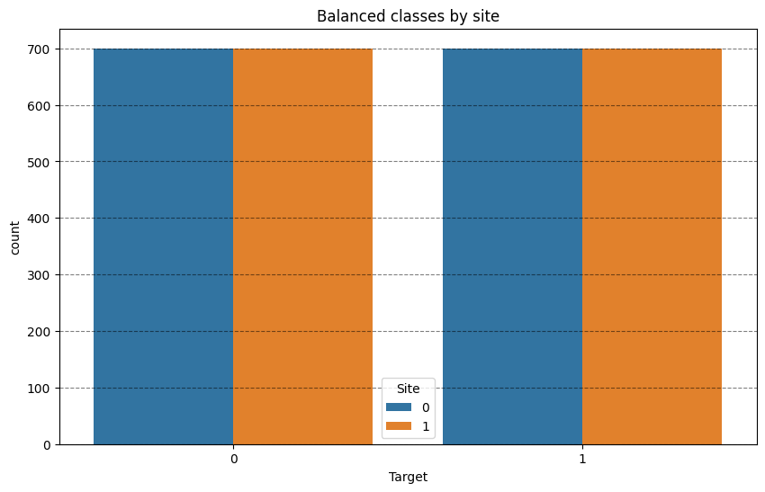

# Using ICI for binary classification problem.

## Importing necesary moduls


```python
import matplotlib.pyplot as plt
import pandas as pd
import seaborn as sbn

from uniharmony.datasets import make_multisite_classification
from uniharmony.interpolation import ICIHarmonization

```

## Generate data using `unharmony` function


```python
X, y, sites = make_multisite_classification(
    n_classes=2,
    n_samples=2000,
    n_sites=2,
    n_features=2,
    balance_per_site=[0.3, 0.7],
    site_effect_homogeneous=True,
)
df = pd.DataFrame({"Target": y, "Site": sites})

plt.figure(figsize=[10, 6])
plt.title("Unbalanced classes by site")
sbn.countplot(df, x="Target", hue="Site")
plt.grid(axis="y", color="black", alpha=0.5, linestyle="--")

```





## Let's create a instance of the ICI harmonizer


```python
ici = ICIHarmonization("smote")
X_r, y_r = ici.fit_resample(X, y, sites=sites)
df = pd.DataFrame(
    {
        "Target": y_r,
        "Site": ici.sites_resampled_,
        "Feature 1": X_r[:, 0],
        "Feature 2": X_r[:, 1],
    }
)
plt.figure(figsize=[10, 6])
plt.title("Balanced classes by site")
sbn.countplot(df, x="Target", hue="Site")
plt.grid(axis="y", color="black", alpha=0.5, linestyle="--")

```





# Take home
Now the classes are balanced within each site, thus a ML model would not be able to pick a Effect of Site signal to give a fraudulently good performance
