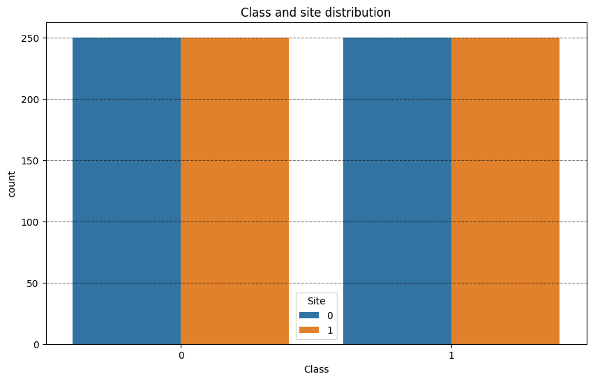
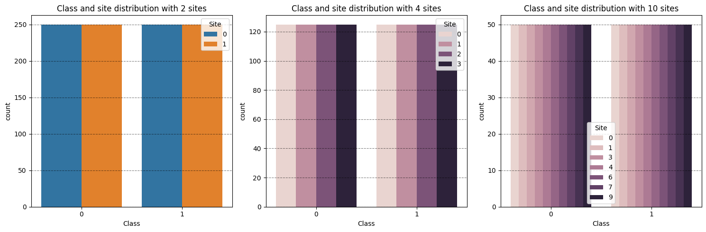
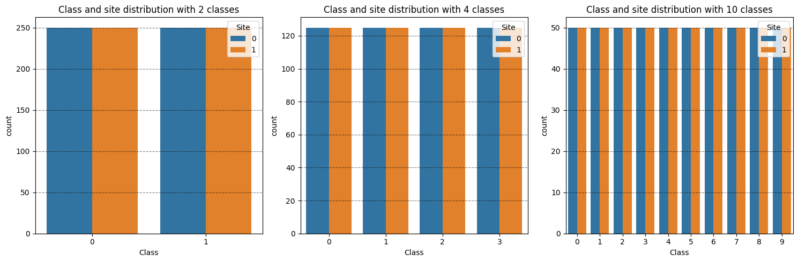
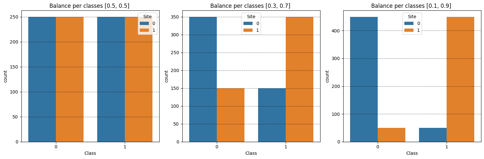
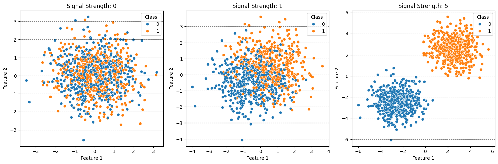
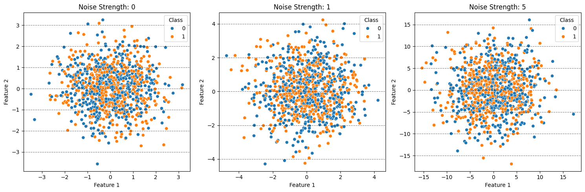
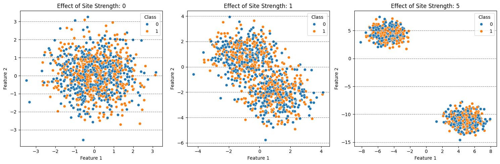

## Let's use the different modes of the `make_multisite_classification` function


```python
# Imports
import matplotlib.pyplot as plt
import pandas as pd
import seaborn as sns

from uniharmony import make_multisite_classification
```

## We will start with the function as default


```python
X, y, sites = make_multisite_classification()
df = pd.DataFrame({"Class": y, "Site": sites})
print(f"X has {X.shape[0]} examples and {X.shape[1]} features")

plt.figure(figsize=[10, 6])
plt.title("Class and site distribution")
sns.countplot(df, x="Class", hue="Site")
plt.grid(axis="y", color="black", alpha=0.5, linestyle="--")
```

    X has 1000 examples and 10 features





Let's increase the number of sites. Note that the total number of samples is the same, but the distribution changed.


```python
fig, axes = plt.subplots(1, 3, figsize=[15, 5])

for idx, n_sites in enumerate([2, 4, 10]):
    X, y, sites = make_multisite_classification(n_sites=n_sites)
    print(f"For n_sites {n_sites}, X has {X.shape[0]} examples and {X.shape[1]} features")

    df_plot = pd.DataFrame(
        {
            "Class": y,
            "Site": sites,
            "Feature 1": X[:, 0],
            "Feature 2": X[:, 1],
        }
    )
    sns.countplot(df_plot, x="Class", hue="Site", ax=axes[idx])
    plt.title("Class and site distribution")

    axes[idx].set_title(f"Class and site distribution with {n_sites} sites")
    axes[idx].grid(axis="y", color="black", alpha=0.5, linestyle="--")

plt.tight_layout()
```

    For n_sites 2, X has 1000 examples and 10 features
    For n_sites 4, X has 1000 examples and 10 features
    For n_sites 10, X has 1000 examples and 10 features





```python
fig, axes = plt.subplots(1, 3, figsize=[15, 5])

for idx, n_classes in enumerate([2, 4, 10]):
    X, y, sites = make_multisite_classification(n_classes=n_classes)
    print(f"For n_classes {n_classes}, X has {X.shape[0]} examples and {X.shape[1]} features")

    df_plot = pd.DataFrame(
        {
            "Class": y,
            "Site": sites,
            "Feature 1": X[:, 0],
            "Feature 2": X[:, 1],
        }
    )
    sns.countplot(df_plot, x="Class", hue="Site", ax=axes[idx])
    axes[idx].set_title(f"Class and site distribution with {n_classes} classes")
    axes[idx].grid(axis="y", color="black", alpha=0.5, linestyle="--")

plt.tight_layout()
```

    For n_classes 2, X has 1000 examples and 10 features
    For n_classes 4, X has 1000 examples and 10 features
    For n_classes 10, X has 1000 examples and 10 features





## Changing the class balance:
As default, the created problem is balanced accross sites, so all classes has the same number of examples in each site.
We can control that using the `balance_per_site` of the function.


```python
# In a binary classification problem, you need to set which
# proportion of class 1 is present in that site.
# Thus, the number of elements in the list must match the number of sites.
fig, axes = plt.subplots(1, 3, figsize=[15, 5])
balance_per_site_list = [[0.5, 0.5], [0.3, 0.7], [0.1, 0.9]]
for idx, balance_per_site in enumerate(balance_per_site_list):
    X, y, sites = make_multisite_classification(balance_per_site=balance_per_site)
    print(f"For n_classes {n_classes}, X has {X.shape[0]} examples and {X.shape[1]} features")

    df_plot = pd.DataFrame(
        {
            "Class": y,
            "Site": sites,
            "Feature 1": X[:, 0],
            "Feature 2": X[:, 1],
        }
    )
    sns.countplot(df_plot, x="Class", hue="Site", ax=axes[idx])
    axes[idx].set_title(f"Balance per classes {balance_per_site} ")
    axes[idx].grid(axis="y", color="black", alpha=0.5, linestyle="--")

plt.tight_layout()
```

    For n_classes 10, X has 1000 examples and 10 features
    For n_classes 10, X has 1000 examples and 10 features
    For n_classes 10, X has 1000 examples and 10 features





Now that we changed the balance, we have different occurence in different sites. Note that the total number of classes is still balanced, is the distribution accross sites that changed.

# Let's now see how the signal looks like


```python
fig, axes = plt.subplots(1, 3, figsize=[15, 5])

for idx, signal_st in enumerate([0, 1, 5]):
    X, y, sites = make_multisite_classification(
        n_features=2,
        signal_strength=signal_st,
        noise_strength=0,
        site_effect_strength=0,
    )

    df_plot = pd.DataFrame(
        {
            "Class": y,
            "Site": sites,
            "Feature 1": X[:, 0],
            "Feature 2": X[:, 1],
        }
    )

    sns.scatterplot(df_plot, x="Feature 1", y="Feature 2", hue="Class", ax=axes[idx])
    axes[idx].set_title(f"Signal Strength: {signal_st}")
    axes[idx].grid(axis="y", color="black", alpha=0.5, linestyle="--")

plt.tight_layout()
```





```python
fig, axes = plt.subplots(1, 3, figsize=[15, 5])

for idx, noise_st in enumerate([0, 1, 5]):
    X, y, sites = make_multisite_classification(
        n_features=2,
        signal_strength=0,
        noise_strength=noise_st,
        site_effect_strength=0,
    )

    df_plot = pd.DataFrame(
        {
            "Class": y,
            "Site": sites,
            "Feature 1": X[:, 0],
            "Feature 2": X[:, 1],
        }
    )

    sns.scatterplot(df_plot, x="Feature 1", y="Feature 2", hue="Class", ax=axes[idx])
    axes[idx].set_title(f"Noise Strength: {noise_st}")
    axes[idx].grid(axis="y", color="black", alpha=0.5, linestyle="--")

plt.tight_layout()
# Note how the axis change scale
```





```python
fig, axes = plt.subplots(1, 3, figsize=[15, 5])

for idx, site_st in enumerate([0, 1, 5]):
    X, y, sites = make_multisite_classification(
        n_features=2,
        signal_strength=0,
        noise_strength=0,
        site_effect_strength=site_st,
    )

    df_plot = pd.DataFrame(
        {
            "Class": y,
            "Site": sites,
            "Feature 1": X[:, 0],
            "Feature 2": X[:, 1],
        }
    )

    sns.scatterplot(df_plot, x="Feature 1", y="Feature 2", hue="Class", ax=axes[idx])
    axes[idx].set_title(f"Effect of Site Strength: {site_st}")
    axes[idx].grid(axis="y", color="black", alpha=0.5, linestyle="--")

plt.tight_layout()
```



